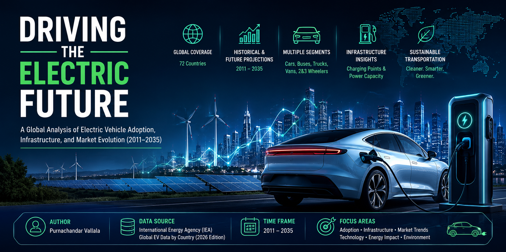

# ⚡ Global EV Intelligence Dashboard

> **Interactive Business Intelligence Analysis of the Global Electric Vehicle Market (2010–2035)**



---

## 🌐 Live Demo

🚀 **Interactive Dashboard**

**Live Application**

(https://dataviz-exercises-purnachandar-vallala-jut4nz84v9nxe8hn5xr7ht.streamlit.app/)

Experience the complete interactive dashboard online without installing any software.

---

## 💻 GitHub Repository

Repository Link

(https://github.com/VallalaPurnachandar/dataviz-exercises-Purnachandar-Vallala/tree/main/EV_Global_Intelligence_Final_project)

Clone the repository

```bash
git clone (https://github.com/VallalaPurnachandar/dataviz-exercises-Purnachandar-Vallala/tree/main/EV_Global_Intelligence_Final_project)
```

---

# 📖 Project Overview

The **Global EV Intelligence Dashboard** is an end-to-end Business Intelligence project developed to analyze the global Electric Vehicle (EV) market using the **International Energy Agency (IEA) Global EV Outlook Dataset**.

The project combines **data engineering, exploratory data analysis, forecasting, and interactive dashboard development** to provide valuable insights into the growth of electric vehicles worldwide.

The dashboard enables policymakers, researchers, businesses, and investors to explore historical trends, compare countries, analyze vehicle technologies, investigate charging infrastructure, evaluate EV pricing, and understand future market projections through an interactive web application.

---

# 🎯 Project Objectives

The primary objectives of this project are:

- Analyze the global EV market between **2010 and 2035**
- Compare EV adoption across 72 countries
- Study historical and forecast market trends
- Analyze EV sales and EV stock
- Explore charging infrastructure growth
- Understand electricity demand from EVs
- Analyze vehicle technologies
- Compare EV pricing across countries
- Build an interactive Business Intelligence dashboard
- Generate executive insights for decision makers

---

# 📂 Project Structure

```text
Global_EV_Intelligence/
│
├── dashboard/
│   ├── app.py
│   │
│   ├── pages/
│   │   ├── 1_📊_Market_Overview.py
│   │   ├── 2_🌍_Country_Explorer.py
│   │   ├── 3_🚗_Vehicle_Technology_Analysis.py
│   │   ├── 4_⚡_Infrastructure_Energy.py
│   │   ├── 5_💰_Price_Intelligence.py
│   │   ├── 6_📈_Future_Outlook.py
│   │   └── 7_💼_Executive_Insights.py
│   │
│   └── utils/
│       ├── loader.py
│       ├── charts.py
│       ├── filters.py
│       └── styles.py
│
├── notebooks/
│   ├── Notebook_1_Data_Preparation.ipynb
│   ├── Notebook_2_Business_Analysis.ipynb
│   └── Notebook_3_Forecast_Analysis.ipynb
│
├── data/
│   ├── raw/
│   └── processed/
│       └── ev_analysis_ready.csv
│
├── images/
│   ├── logo.png
│   ├── cover_banner.png
│   ├── dashboard_home.png
│   ├── dashboard_market.png
│   ├── dashboard_country.png
│   └── dashboard_executive.png
│
├── README.md
├── requirements.txt
└── .gitignore
```

---

# 📊 Dataset

**Source**

International Energy Agency (IEA)

Global EV Outlook Dataset

---

### Dataset Summary

| Feature | Value |
|----------|-------|
| Countries | 72 |
| Years | 2010–2035 |
| Records | 49,360 |
| Parameters | 19 |
| Historical Data | Yes |
| Forecast Data | Yes |

---

# 🛠 Technologies Used

### Programming

- Python

### Data Analysis

- Pandas
- NumPy

### Visualization

- Plotly
- Streamlit

### Development Tools

- Jupyter Notebook
- VS Code
- Git
- GitHub

---

# 🚀 Dashboard Features

## 🏠 Home

- Executive KPI Dashboard
- Global EV Sales Overview
- Interactive Dataset Explorer
- Business Insights

---

## 📊 Market Overview

- EV Sales Trend
- EV Stock Trend
- Market Growth Analysis
- Global Market Comparison

---

## 🌍 Country Explorer

- Country Comparison
- Historical EV Trends
- Country Rankings
- Interactive Filtering

---

## 🚗 Vehicle Technology Analysis

- Vehicle Type Analysis
- Powertrain Comparison
- Technology Distribution
- Vehicle Segment Insights

---

## ⚡ Infrastructure & Energy

- Charging Infrastructure
- Electricity Demand
- Battery Deployment
- Energy Transition Analysis

---

## 💰 Price Intelligence

- EV Price Distribution
- Country Price Comparison
- Market Affordability
- Pricing Trends

---

## 📈 Future Outlook

- Historical vs Forecast
- CPS Scenario
- STEPS Scenario
- Growth Projection

---

## 💼 Executive Insights

- Strategic Recommendations
- Business Conclusions
- Market Opportunities
- Executive Dashboard

---

# 📈 Key Business Insights

- Global EV adoption has increased significantly since 2015.
- China continues to dominate the global EV market.
- Passenger cars remain the largest EV segment.
- Public charging infrastructure has expanded rapidly worldwide.
- Battery deployment continues to increase with EV demand.
- Electricity demand from EVs is expected to grow steadily.
- Forecast scenarios indicate strong market expansion through 2035.
- Government policies continue to accelerate EV adoption globally.

---

# 📸 Dashboard Preview

## 🏠 Home Dashboard


---

## 📊 Market Overview


---

## 🌍 Country Explorer


---

## 💼 Executive Insights


---

# ⚙ Installation

Clone the repository

```bash
git clone (https://github.com/VallalaPurnachandar/dataviz-exercises-Purnachandar-Vallala/tree/main/EV_Global_Intelligence_Final_project)
```

Move into the project directory

```bash
cd Global_EV_Intelligence
```

Install dependencies

```bash
pip install -r requirements.txt
```

Run the Streamlit dashboard

```bash
cd dashboard

streamlit run app.py
```

---

# ☁ Deployment

The dashboard is deployed using **Streamlit Community Cloud**.

Live Dashboard

(https://dataviz-exercises-purnachandar-vallala-jut4nz84v9nxe8hn5xr7ht.streamlit.app/)

---

# 📈 Future Enhancements

Future improvements may include:

- Real-time EV market data integration
- Machine Learning forecasting models
- Interactive world maps
- Carbon emission estimation
- Battery lifecycle analysis
- Charging station optimization
- Advanced predictive analytics
- User authentication
- Database integration
- API connectivity

---

# 📋 Project Highlights

✅ Interactive Business Intelligence Dashboard

✅ Analysis of 72 Countries

✅ Historical & Forecast Data (2010–2035)

✅ Executive KPI Dashboard

✅ Forecast Analysis

✅ Country-Level Analysis

✅ Vehicle Technology Insights

✅ Charging Infrastructure Analysis

✅ Price Intelligence

✅ Executive Business Recommendations

---

# 👨‍💻 Author

**Purnachandar Vallala**

Master's in Data Science

---

# 🙏 Acknowledgements

Special thanks to:

- International Energy Agency (IEA)
- Streamlit
- Plotly
- Pandas
- NumPy
- Python Community

---

# 📜 License

This project has been developed for academic purposes as part of a Master's in Data Science coursework.

---

⭐ **If you found this project useful, please consider giving it a Star on GitHub!**
